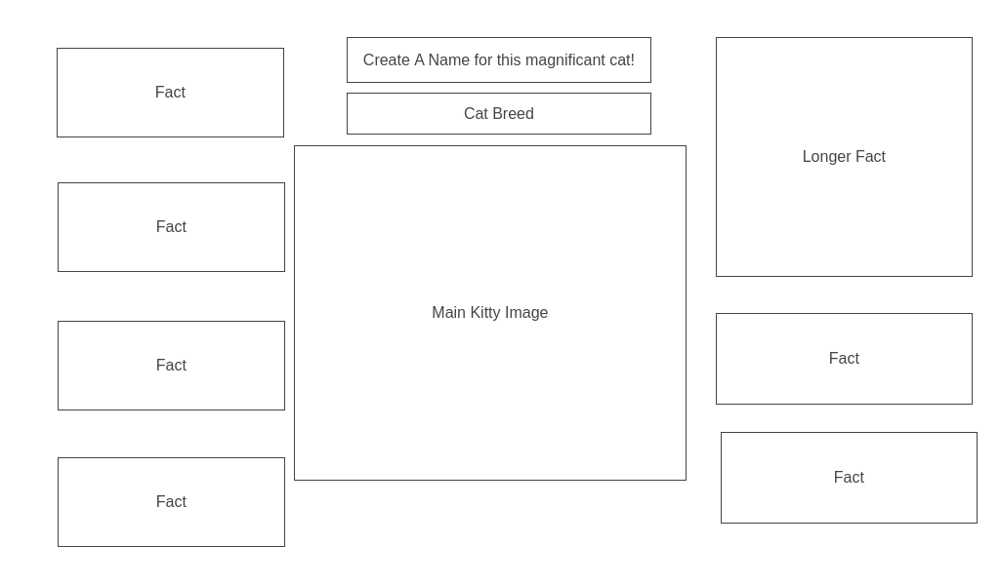

# Cute-Cat-Club
Built in Vanilla JavaScript 
## Description

#### Cute Cat Club is a visualizer of different cat breeds and interesting data about each one. The user will be presented a page to search their favorite breeds. The page will dispaly the requested data for the specific breed in a fun styalized way. There areinteractive elements of the page, allowing users to customize and style their Cute Cat Club experience. Becuase every day is a party...but mostly a nap...at the Cute Cat Club.

## Because every cat in the world is the cutest cat in the world...All cats are by default members of the Cute Cat Club. 

#### I'll be using the D3 library to help visualize some of the data. As well other CSS and JS styling.

